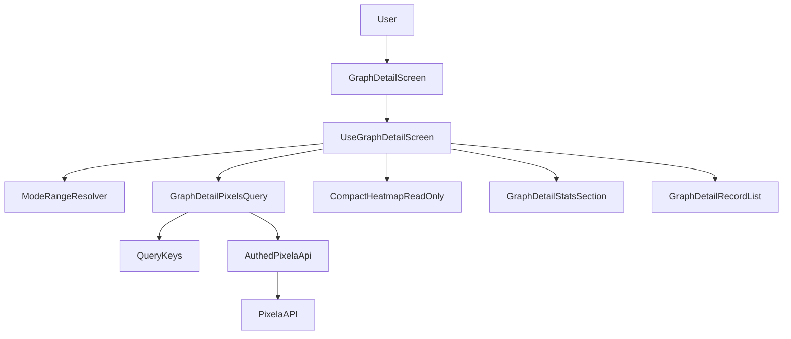
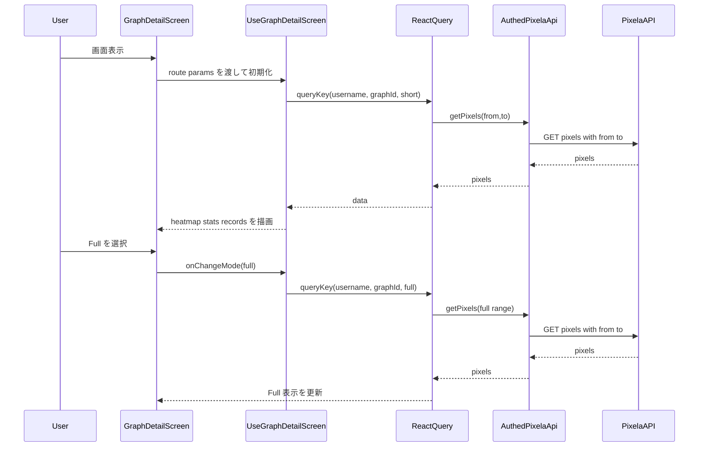

# Design Document

## Overview
Graph Detail を既存実装の拡張として再設計し、表示モードを `Short`（14週）と `Full`（53週）へ統一する。主目的は、習慣の状況を短時間で把握できる可視化体験を維持しつつ、要件で追加された表示範囲と操作制約（セルタップ追加なし）を明確な境界で実現することである。

本設計は `src/app -> src/features -> src/shared` の既存レイヤリングを維持し、Graph Detail 画面の mode 管理・期間算出・query key 連携に加え、ワイヤーフレーム（`design/pixel-habit.pen` の `GraphDetail`）で示された KPI チップ行（アイコン+値+ラベル）を UI 契約として明文化する。Pixela 連携は既存の `useAuthedPixelaApi` と `getPixels(from,to)` 契約を継続利用し、新規外部依存は導入しない。

### Goals
- `Short/Full` の表示モードを要件どおりの週数（14/53）で一貫提供する
- Graph Detail でヒートマップと統計を同一表示条件で同期する
- 既存の読み込み・エラー・再試行・遷移パターンを維持し回帰を最小化する

### Non-Goals
- Pixel 追加/編集フローの再設計
- Pixela API 契約の変更
- Home の Habits カード UI 仕様変更

## Architecture

### Existing Architecture Analysis
- 現在の Graph Detail は `useGraphDetailScreen` が mode・期間算出・query 実行を統合管理する。
- mode は `month/year` で、query key は `graphDetailPixels(username, graphId, mode)`。
- 表示層は Range/Info/Stats/RecordList の分割コンポーネント構成で、ローディングとエラー再試行導線を備える。

### Architecture Pattern & Boundary Map
**Architecture Integration**:
- Selected pattern: 既存 Feature Hook 主導パターンを継続（UI は受動、Hook が状態境界を保持）
- Domain/feature boundaries: `graphs` feature が表示モードと可視化責務を持ち、API/認証は `shared` 側境界を維持
- Existing patterns preserved: `useAuthedPixelaApi`、React Query key 集約、Expo Router params 解釈
- New components rationale: 表示モード再定義と週次範囲算出を明示する小さな契約追加
- Steering compliance: TypeScript strict・feature-first 構造・shared API 集約方針を維持



### Technology Stack & Alignment

| Layer | Choice / Version | Role in Feature | Notes |
|-------|------------------|-----------------|-------|
| Frontend | Expo Router 6 + React Native 0.81 | route params と画面遷移 | 現行画面構成を維持 |
| State/Data Fetch | @tanstack/react-query (v5 系) | mode 切替時のデータキャッシュ分離 | key に `short/full` を含める |
| UI | heroui-native + 既存 feature components | モード切替タブ、統計、一覧、ヒートマップ | 新規 UI ライブラリ追加なし |
| API Layer | `src/shared/api` (`useAuthedPixelaApi`, `getPixels`) | `from/to` 指定の pixel 取得 | Pixela 契約を継続利用 |
| Runtime | Expo 54 / React 19 | 既存実行基盤 | 変更なし |

## System Flows



Flow-level decisions:
- mode ごとに query key を分離し、Short/Full のキャッシュ混線を防止する。
- ヒートマップは read-only 表示とし、セルタップでの追加操作を提供しない。

## Requirements Traceability

| Requirement | Summary | Components | Interfaces | Flows |
|-------------|---------|------------|------------|-------|
| 1.1 | Detail 起動時に対象 Graph 識別情報を表示 | GraphDetailScreen, GraphDetailInfoSection | State | 初期表示フロー |
| 1.2 | 初期表示後に主要可視化を表示 | GraphDetailHeatmapSection, GraphDetailKpiSection | State | 初期表示フロー |
| 1.3 | 現在 Graph の明示 | useGraphDetailScreen(header title) | State | 初期表示フロー |
| 2.1 | Short/Full 切替手段提供 | GraphDetailRangeSection | State | モード切替フロー |
| 2.2 | Short=14週ヒートマップ表示 | ModeRangeResolver, GraphDetailHeatmapSection | Service, State | モード切替フロー |
| 2.3 | Full=53週ヒートマップ表示 | ModeRangeResolver, GraphDetailHeatmapSection | Service, State | モード切替フロー |
| 2.4 | 選択中モードの視覚表示 | GraphDetailRangeSection | State | モード切替フロー |
| 2.5 | 同一モード再選択時の一貫性 | useGraphDetailScreen | State | モード切替フロー |
| 2.6 | セルタップ追加を提供しない | GraphDetailHeatmapSection | State | 初期表示/切替フロー |
| 3.1 | KPI チップによる表示モード対応の統計表示 | GraphDetailKpiSection, GraphDetailSummaryBuilder | Service, State | 初期表示/切替フロー |
| 3.2 | モード変更時の統計同期更新 | useGraphDetailScreen, GraphDetailPixelsQuery | Service, State | モード切替フロー |
| 3.3 | 記録なし統計表示 | GraphDetailSummaryBuilder | Service | 初期表示/切替フロー |
| 4.1 | 読み込み状態表示 | GraphDetailScreen | State | 初期表示/再試行フロー |
| 4.2 | 取得失敗メッセージ表示 | useGraphDetailScreen, GraphDetailScreen | State | 初期表示/再試行フロー |
| 4.3 | 再取得手段提供 | GraphDetailScreen | State | 再試行フロー |
| 4.4 | 再取得成功時の復帰 | GraphDetailScreen, GraphDetailPixelsQuery | State | 再試行フロー |
| 5.1 | 戻る遷移文脈維持 | useGraphDetailScreen(router/nav) | State | 画面遷移フロー |
| 5.2 | 再訪時の状態一貫性 | useGraphDetailScreen | State | 初期化フロー |
| 5.3 | 複数導線で同等主要情報 | GraphDetailScreen | State | 初期表示フロー |

## Components & Interface Contracts

| Component | Domain/Layer | Intent | Req Coverage | Key Dependencies (P0/P1) | Contracts |
|-----------|--------------|--------|--------------|--------------------------|-----------|
| GraphDetailScreen | Feature/UI | 画面構成と状態別レンダリング | 1.1, 1.2, 4.1, 4.3, 4.4, 5.3 | useGraphDetailScreen (P0) | State |
| useGraphDetailScreen | Feature/Hook | mode・期間・query・遷移の統合管理 | 1.3, 2.5, 3.2, 4.2, 5.1, 5.2 | useAuthedPixelaApi (P0), React Query (P0) | Service, State |
| ModeRangeResolver | Shared/Lib | short/full から期間情報を決定 | 2.2, 2.3 | date utility (P1) | Service |
| GraphDetailRangeSection | Feature/UI | Short/Full 切替 UI | 2.1, 2.4 | mode state (P0) | State |
| GraphDetailHeatmapSection | Feature/UI | 14/53 週ヒートマップ表示（read-only） | 1.2, 2.2, 2.3, 2.6 | CompactHeatmap (P0) | State |
| GraphDetailKpiSection | Feature/UI | アイコン付き KPI チップ列を表示 | 3.1, 3.3 | GraphDetailSummaryBuilder (P0) | State |
| GraphDetailPixelsQuery | Shared/API-usage | mode/graphId に応じた期間 pixel 取得 | 3.2, 4.1, 4.2, 4.4 | queryKeys, useAuthedPixelaApi (P0) | Service, State |
| GraphDetailSummaryBuilder | Shared/Lib | 表示範囲内の統計計算 | 3.1, 3.3 | pixel list (P0) | Service |

### Feature Layer

#### useGraphDetailScreen

| Field | Detail |
|-------|--------|
| Intent | Graph Detail の画面状態・遷移・データ取得境界を統合する |
| Requirements | 1.3, 2.5, 3.2, 4.2, 5.1, 5.2 |

**Responsibilities & Constraints**
- route params から `graphId` と表示用情報を解釈する
- `GraphDetailDisplayMode` を状態管理し、mode に応じた range と query key を選択する
- mode 再選択で不要な状態変化を発生させない

**Dependencies**
- Inbound: GraphDetailScreen — 画面表示とイベント接続 (P0)
- Outbound: GraphDetailPixelsQuery — ピクセル取得 (P0)
- Outbound: ModeRangeResolver — 期間算出 (P0)
- External: Expo Router Navigation — 遷移制御 (P1)

**Contracts**: Service [x] / API [ ] / Event [ ] / Batch [ ] / State [x]

##### Service Interface
```typescript
type GraphDetailDisplayMode = "short" | "full";

interface GraphDetailRange {
  from: string;
  to: string;
  weeks: 14 | 53;
}

interface UseGraphDetailScreenResult {
  mode: GraphDetailDisplayMode;
  range: GraphDetailRange;
  pixels: Pixel[];
  summary: GraphDetailSummary;
  errorMessage: string | null;
  isPending: boolean;
  onChangeMode: (next: GraphDetailDisplayMode) => void;
  onRetry: () => void;
}
```
- Preconditions:
  - `graphId` が route params で解決可能であること
- Postconditions:
  - mode と range が常に整合し、同一 mode では再取得を強制しない
- Invariants:
  - `summary` は常に `pixels` と同一表示範囲に対応する

**Implementation Notes**
- Integration: 既存 header menu/record detail 遷移ロジックを維持して mode 周辺のみ置換
- Validation: mode 切替・再選択・graphId 異常時の挙動を integration test で固定
- Risks: Hook 肥大化は将来 `useGraphDetailMode` 分離で緩和可能

#### GraphDetailHeatmapSection

| Field | Detail |
|-------|--------|
| Intent | Graph Detail で期間対応ヒートマップを read-only 表示 |
| Requirements | 1.2, 2.2, 2.3, 2.6 |

**Responsibilities & Constraints**
- mode から解決した `weeks`（14/53）でヒートマップを描画
- セルタップによる追加導線を公開しない

**Dependencies**
- Inbound: useGraphDetailScreen — mode/range/pixels の受領 (P0)
- Outbound: CompactHeatmap — 表示実装再利用 (P0)

**Contracts**: Service [ ] / API [ ] / Event [ ] / Batch [ ] / State [x]

##### State Management
- State model: 受け取り props による受動表示
- Persistence & consistency: 永続化なし、mode と pixels の再描画同期のみ
- Concurrency strategy: React 再レンダリング一貫性に準拠

**Implementation Notes**
- Integration: `CompactHeatmap` を `onPressCell` 未指定で利用
- Validation: セル押下で追加導線が発火しないことを UI テストで担保
- Risks: 53週描画で画面幅超過時は横スクロール/縮尺検討が必要

#### GraphDetailKpiSection

| Field | Detail |
|-------|--------|
| Intent | 統計を KPI チップ（アイコン+値+ラベル）として表示する |
| Requirements | 3.1, 3.3 |

**Responsibilities & Constraints**
- ワイヤーフレーム準拠で 4 チップ（記録日数、累計、平均、今日）を同一行で表示する
- 各チップは `icon`, `value`, `label` の 3 要素を必須とする
- 欠損時は値をプレースホルダ（例: `—`）で示し、レイアウト崩れを防ぐ

**Dependencies**
- Inbound: useGraphDetailScreen — summary の受領 (P0)
- Outbound: GraphDetailSummaryBuilder — 表示値算出 (P0)
- External: Icon library (`@expo/vector-icons` または同等) — KPI アイコン描画 (P1)

**Contracts**: Service [ ] / API [ ] / Event [ ] / Batch [ ] / State [x]

##### State Management
- State model: `GraphDetailSummary` を `KpiChipViewModel[]` に変換して描画
- Persistence & consistency: 永続化なし、mode 切替に同期して再描画
- Concurrency strategy: React 再レンダリング一貫性に準拠

**Implementation Notes**
- Integration: 既存 `GraphDetailStatsSection` を置換または内部再構成し、画面からは単一 KPI セクションとして扱う
- Validation: 4 指標それぞれにアイコンとラベルが常に表示されることをテストで固定
- Risks: アイコン名差し替え時の視認性低下をデザインレビューで確認する

### Shared Layer

#### ModeRangeResolver

| Field | Detail |
|-------|--------|
| Intent | `short/full` を `from/to/weeks` に決定変換する |
| Requirements | 2.2, 2.3 |

**Responsibilities & Constraints**
- Short は Habits と同一 14週、Full は 53週を常に返す
- 基準日はローカル日付の当日 00:00 とし、将来日を含めない

**Dependencies**
- Inbound: useGraphDetailScreen — mode 入力 (P0)
- External: Date utility — 日付正規化 (P1)

**Contracts**: Service [x] / API [ ] / Event [ ] / Batch [ ] / State [ ]

##### Service Interface
```typescript
type GraphDetailDisplayMode = "short" | "full";

interface GraphDetailRange {
  from: string;
  to: string;
  weeks: 14 | 53;
}

interface GraphDetailRangeResolver {
  resolve(mode: GraphDetailDisplayMode, baseDate?: Date): GraphDetailRange;
}
```
- Preconditions:
  - mode は `short` または `full`
- Postconditions:
  - `short => weeks=14`、`full => weeks=53`
- Invariants:
  - `from <= to`、日付は `yyyyMMdd`

#### GraphDetailPixelsQuery

| Field | Detail |
|-------|--------|
| Intent | mode ごとの期間で pixel 一覧を取得しキャッシュ分離する |
| Requirements | 3.2, 4.1, 4.2, 4.4 |

**Responsibilities & Constraints**
- query key に `username`, `graphId`, `mode` を含める
- 認証未解決時は既存方針どおり query を抑止する

**Dependencies**
- Inbound: useGraphDetailScreen — graphId/mode/range (P0)
- Outbound: useAuthedPixelaApi.getPixels — API 呼び出し (P0)
- Outbound: queryKeys.graphDetailPixels — key 生成 (P0)

**Contracts**: Service [x] / API [ ] / Event [ ] / Batch [ ] / State [x]

##### Service Interface
```typescript
type GraphDetailDisplayMode = "short" | "full";

interface GraphDetailPixelsQueryInput {
  username: string | null;
  graphId: string;
  mode: GraphDetailDisplayMode;
  from: string;
  to: string;
  enabled: boolean;
}

interface GraphDetailPixelsQueryResult {
  data: Pixel[] | undefined;
  isPending: boolean;
  error: Error | null;
  refetch: () => Promise<unknown>;
}
```
- Preconditions:
  - `enabled=true` の場合 `graphId` は非空
- Postconditions:
  - 成功時は対象期間の `Pixel[]` を返す
- Invariants:
  - key 同一条件では同一キャッシュ領域を利用する

## Data Models

### Domain Model
- **GraphDetailViewState**（表示集約）
  - `graphId`, `mode`, `range`, `pixels`, `summary`, `uiStatus`
- **GraphDetailDisplayMode**（値オブジェクト）
  - `short | full`
- **GraphDetailRange**（値オブジェクト）
  - `from`, `to`, `weeks(14|53)` を保持し、mode と 1:1 対応する

### Logical Data Model
- 既存 `Pixel` エンティティ（`date`, `quantity`, `optionalData`）を継続利用する。
- Graph Detail 専用に永続化スキーマは追加しない。
- query キャッシュの論理キーは `graphDetailPixels(username, graphId, mode)` とし、mode ごとに分離する。

### Data Contracts & Integration
- **API Data Transfer**
  - Request: `GET /v1/users/{username}/graphs/{graphId}/pixels?from={yyyyMMdd}&to={yyyyMMdd}&withBody=true`
  - Response: `Pixel[]`（既存正規化処理を適用）
- **Cross-Service Data Management**
  - 外部連携は Pixela API 単一で、分散トランザクションは不要
  - 失敗時は UI 再試行で回復する

## Error Handling

### Error Strategy
- 認証未解決、`graphId` 不正、API 取得失敗を区別してメッセージ化する。
- Full 表示でもエラー処理の分岐は増やさず、既存の単一再試行導線を維持する。

### Error Categories and Responses
- User Errors (4xx 相当)
  - `graphId` 不正: Graph Detail は復帰案内メッセージを表示する
  - 認証情報欠落: 再ログイン誘導メッセージを表示する
- System Errors (5xx/ネットワーク)
  - ピクセル取得失敗: エラーメッセージ + 再試行ボタンを表示する
- Business Logic Errors
  - 対象期間記録なし: エラーではなく空状態統計と空一覧メッセージを表示する

### Monitoring
- 既存エラー境界に従い、React Query `error` を UI 状態へ反映する。
- 実装時に Full モードの API 遅延時間を計測し、閾値超過時は改善タスク化する。

## Testing Strategy

### Unit Tests
- ModeRangeResolver が `short=14` / `full=53` を返すこと
- mode から `from/to` が `yyyyMMdd` で生成されること
- GraphDetailSummaryBuilder が記録なしケースで期待値を返すこと

### Integration Tests
- Graph Detail 初期表示で Short 期間が使用されること
- Full 切替時に 53週相当の期間で `getPixels` が再取得されること
- 同一 mode 再選択で不要な追加取得が発生しないこと
- API 失敗時にエラー表示と再試行導線が機能すること

### E2E/UI Tests
- Short/Full タブ切替でヒートマップ表示が更新されること
- Graph Detail でセルタップしても追加導線が起動しないこと
- KPI チップ 4 件がアイコン・値・ラベルを保持して表示されること
- レコード行タップで Pixel Detail 遷移できること

### Performance/Load
- Full(53週) モード初回表示の体感遅延をスモーク計測する
- 連続 mode 切替時に UI フリーズが発生しないことを確認する
