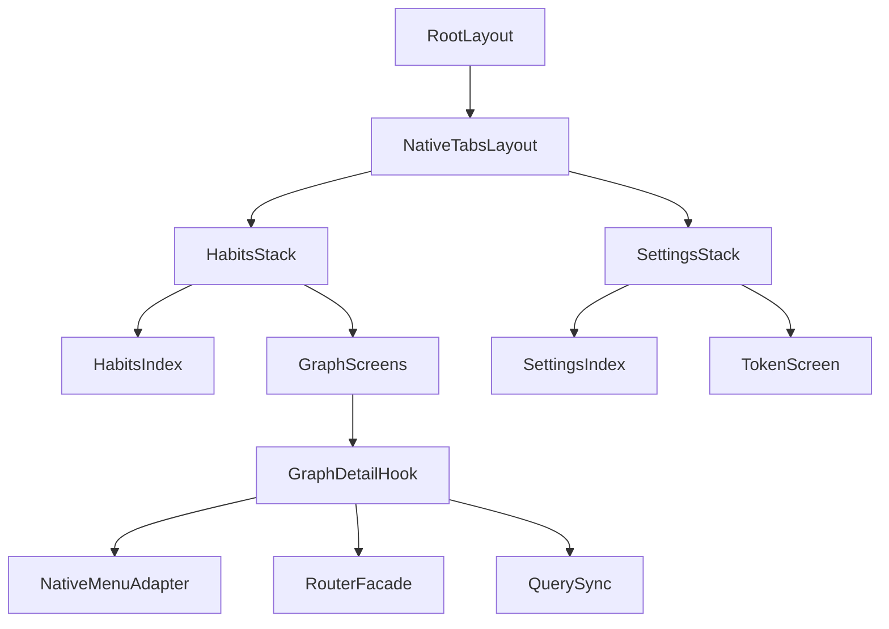
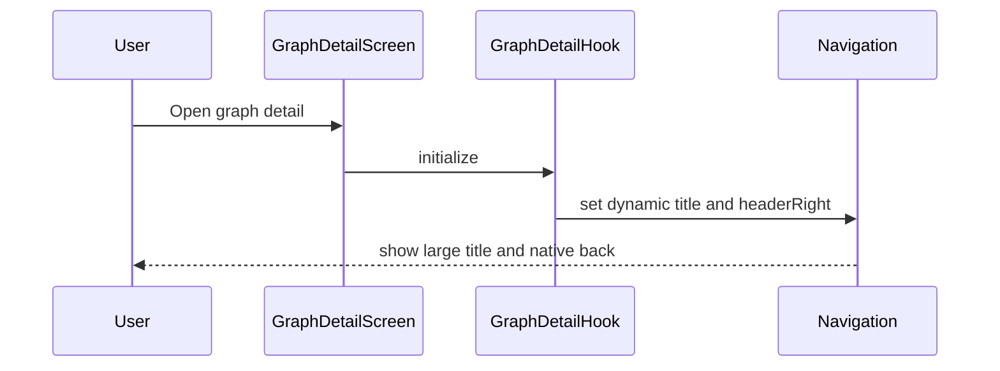
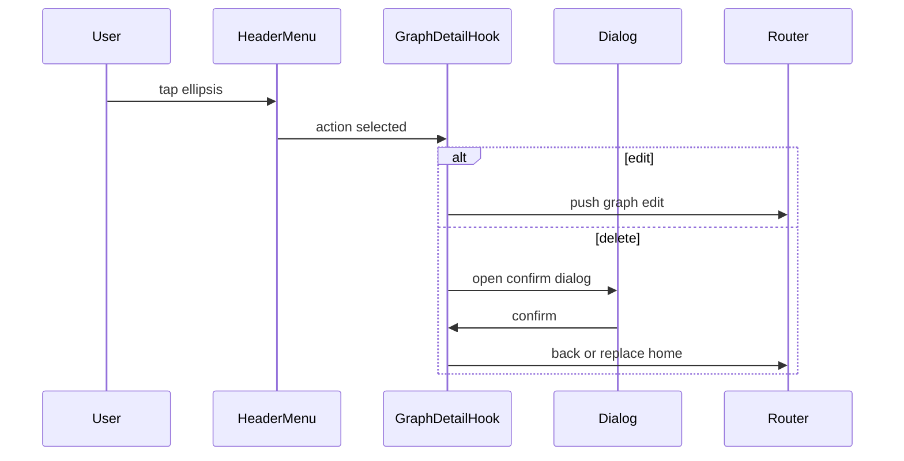

# Design Document

## Overview
本機能は、既存 Pixel Habit のナビゲーションを「見た目の模倣」ではなく、Expo Router と各OSの標準挙動に整合する形で再定義する。対象は Habits/Settings タブ、タブ内 Stack、Graph Detail ヘッダー（Large Title・戻る・右上メニュー）である。

この変更は新規ドメイン追加ではなく既存導線の安定化であり、主要価値は「回帰の減少」「プラットフォーム一貫性」「運用判断の明確化（Expo Go と Dev Client）」にある。

### Goals
- タブ/スタック/ヘッダーの責務境界を固定し、標準ナビ挙動を再現性高く維持する。
- Graph Detail の右上 `...` 操作をネイティブメニュー優先で安定提供する。
- 要件ID単位でテスト責務を紐づけ、回帰検出を強化する。

### Non-Goals
- 新規業務機能（記録項目追加、統計ロジック拡張）は行わない。
- API契約（Pixelaリクエスト/レスポンス）変更は行わない。
- 全画面のUI再デザインは本スコープ外。

## Architecture

### Existing Architecture Analysis
- 既存は `src/app`（routing）→ `src/features`（screen/hook）→ `src/shared`（共通基盤）の3層。
- Tabs 配下に Home/Settings それぞれの nested Stack が存在し、方針は既に適合可能。
- 問題点は「静的ヘッダー設定」と「画面依存の動的設定」が混在し、変更時に戻る導線・タイトル重複が再発しやすい点。

### Architecture Pattern & Boundary Map
**Selected pattern**: Hybrid Navigation Governance（静的=layout、動的=feature hook）



**Boundary decisions**
- `src/app/**/_layout.tsx`: static policy（title mode, default back behavior, static header options）
- `src/features/**/hooks`: dynamic policy（graph名、menu actions、画面依存アクション）
- `src/shared/*`: routes, tokens, query/invalidation, dialog fallback

## Technology Stack & Alignment

| Layer | Choice / Version | Role in Feature | Notes |
|-------|------------------|-----------------|-------|
| Navigation | expo-router `~6.0.14` + Native Tabs | Native Tabs + nested Stack + header config | タブ基盤を Native Tabs に固定 |
| UI/Menu | `@react-native-menu/menu` `^2.0.0` | iOS/Android ネイティブ `...` メニュー | Expo Go制約をfallbackで吸収 |
| UI Base | heroui-native `^1.0.0-beta.13` | 共通UI（Button, Card, Dialog等） | メニュー本体はネイティブ優先 |
| Runtime | Expo `~54.0.22`, RN `0.81.5` | platform差異を吸収 | Dev Clientを検証基準に含める |
| Testing | jest-expo + RNTL | ナビ回帰テスト | layoutレベル検証を追加 |

## System Flows

### Flow 1: Graph Detail ヘッダー設定


### Flow 2: 右上 `...` メニュー操作


## Requirements Traceability

| Requirement | Summary | Components | Interfaces | Flows |
|-------------|---------|------------|------------|-------|
| 1.1, 1.2, 1.3, 1.4, 1.5 | ネイティブタブ一貫性と失敗時回復 | `NativeTabsLayout`, `HabitsStackLayout`, `SettingsStackLayout`, `NavigationFallbackPolicy` | `TabNavigationPolicy`, `FallbackNavigationAction` | Flow 1 |
| 2.1, 2.2, 2.3, 2.4 | Large Title画面単位制御と重複排除 | `HomeStackLayout`, `SettingsStackLayout`, `GraphDetailHeaderController` | `HeaderTitlePolicy` | Flow 1 |
| 3.1, 3.2, 3.3, 3.4 | 戻る導線/右上メニュー標準化 | `RootGraphStackLayout`, `NativeMenuAdapter`, `GraphDetailHeaderController` | `HeaderActionMenuContract` | Flow 2 |
| 4.1, 4.2, 4.3, 4.4 | Habits主要導線 | `GraphListScreen`, `GraphCard`, `CompactHeatmap`, `QuickAddSheet` | `HabitsPrimaryActionContract` | なし |
| 5.1, 5.2, 5.3 | iOS/Android同等挙動と互換 | `NativeMenuAdapter`, `DialogFallbackAdapter`, `PlatformBehaviorMatrix` | `PlatformCapabilityContract` | Flow 2 |
| 6.1, 6.2, 6.3 | テスト固定と追跡可能性 | `NavigationRegressionSuite`, `HeaderActionSuite`, `SpecTraceabilityMap` | `RequirementTestMapping` | Flow 1, Flow 2 |

## Components & Interface Contracts

| Component | Domain/Layer | Intent | Req Coverage | Key Dependencies (P0/P1) | Contracts |
|-----------|--------------|--------|--------------|--------------------------|-----------|
| NativeTabsLayout | app routing | Habits/Settings の Native Tabs 基盤を提供 | 1.1, 1.2, 1.3, 1.5 | Expo Router Native Tabs (P0) | State |
| HomeStackLayout | app routing | HabitsトップのLarge Titleと追加導線を管理 | 2.1, 4.1 | Expo Router Stack (P0) | State |
| GraphDetailHeaderController | feature hook | 動的タイトルとヘッダーメニューを設定 | 2.3, 3.3, 3.4 | Navigation API (P0), MenuAdapter (P0) | Service, State |
| NativeMenuAdapter | shared adapter | ネイティブメニュー実行とフォールバック分岐 | 3.3, 5.2, 5.3 | `@react-native-menu/menu` (P0), Dialog (P1) | Service |
| NavigationRegressionSuite | testing | 要件ID単位のナビ回帰検証 | 6.1, 6.2, 6.3 | jest-expo (P0), RNTL (P0) | State |

### Routing Layer

#### NativeTabsLayout
| Field | Detail |
|-------|--------|
| Intent | Native Tabs でタブ遷移とタブ表示を標準化 |
| Requirements | 1.1, 1.2, 1.3, 1.5 |

**Responsibilities & Constraints**
- タブは Habits / Settings の2系統を保持する。
- 各タブの stack context を破壊しない。

**Contracts: State [x]**

##### State Management
- State model: `{ activeTab: "home" | "settings" }`
- Persistence & consistency: OS標準のタブ状態を利用
- Concurrency strategy: 単一UIイベント処理

### Feature Layer

#### GraphDetailHeaderController
| Field | Detail |
|-------|--------|
| Intent | Graph Detail の動的ヘッダー責務を集約 |
| Requirements | 2.3, 3.1, 3.3, 3.4 |

**Dependencies**
- Inbound: `GraphDetailScreen` — 画面状態連携 (P0)
- Outbound: Expo `navigation.setOptions` — ヘッダー反映 (P0)
- Outbound: `RouterFacade` — menu action遷移 (P0)
- External: `@react-native-menu/menu` — native menu entry (P0)

**Contracts: Service [x] / State [x]**

##### Service Interface
```typescript
interface GraphDetailHeaderService {
  configureHeader(input: {
    graphName: string;
    onPressEdit: () => void;
    onPressDelete: () => void;
  }): void;
}
```
- Preconditions: graphName が解決済み
- Postconditions: header title と headerRight action が同期
- Invariants: 標準 back 導線を上書きしない

##### State Management
- State model: `{ menuAvailable: boolean; titleMode: "large" | "standard" }`
- Persistence & consistency: 画面ライフサイクルに依存
- Concurrency strategy: latest config wins

### Shared Layer

#### NativeMenuAdapter
| Field | Detail |
|-------|--------|
| Intent | ネイティブメニュー可否を吸収し同等機能を提供 |
| Requirements | 3.3, 5.2, 5.3 |

**Dependencies**
- Inbound: GraphDetailHeaderController — action定義入力 (P0)
- Outbound: `MenuView` — native action rendering (P0)
- Outbound: `useAppDialog` — fallback action rendering (P1)

**Contracts: Service [x]**

##### Service Interface
```typescript
interface HeaderActionMenuContract {
  open(actions: ReadonlyArray<{
    id: "edit" | "delete";
    title: string;
    role?: "destructive";
  }>): void;
}
```
- Preconditions: actions は1件以上
- Postconditions: いずれかの action path が利用可能
- Invariants: edit/delete 導線は常に維持

## Data Models

### Domain Model
- NavigationPolicy
  - `screenType`: `list | detail | form`
  - `titleMode`: `large | standard`
  - `supportsNativeMenu`: boolean
- HeaderAction
  - `id`: `edit | delete | create`
  - `role`: `default | destructive`

### Logical Data Model
- RequirementTestMapping
  - `requirementId`: string (`1.1` 形式)
  - `testSuite`: string
  - `testCaseIds`: string[]
- PlatformBehaviorMatrix
  - `platform`: `ios | android | expo-go`
  - `menuMode`: `native | fallback`
  - `backMode`: `system`

### Data Contracts & Integration
- ルーティング契約は既存 `appRoutes` を維持。
- APIデータ契約（Pixela）は変更なし。

## Error Handling

### Error Strategy
- ナビ失敗は画面を維持し、recoverable indication を表示する。
- ネイティブメニュー非対応時は Dialog fallback へ即時切替する。

### Error Categories and Responses
- User Errors: 不正導線操作 → 現在画面維持 + 再操作案内
- System Errors: メニュー起動失敗 → fallback action path
- Business Logic Errors: 削除/編集競合 → 既存ダイアログで整合メッセージ表示

### Monitoring
- ナビ関連エラーを screen name / action id / platform で記録する。

## Testing Strategy

### Unit Tests
- Header policy resolver（screenType→titleMode）
- Native menu capability resolver（platform/runtime→menuMode）
- RequirementTestMapping validator（ID形式と重複検知）

### Integration Tests
- Habits/Settings タブ切替後の stack context 維持
- Graph Detail で header title/menu action 反映
- native menu unavailable 時の fallback action 動作

### E2E/UI Tests
- Habits → Graph Detail → 編集/削除メニュー導線
- Settings → token 画面遷移と標準 back
- iOS/Android で back animation と遷移結果同等性確認

### Performance/Load
- タブ切替時の再マウント数監視（不要再描画回避）
- ヘッダー setOptions 実行回数の上限確認

## Security Considerations
- ヘッダーアクションからの destructive 操作は必ず確認ダイアログを挟む。
- 認証遷移は `replace` ポリシーを維持し、履歴経由の誤復帰を避ける。

## Performance & Scalability
- static header 設定を layout に寄せ、renderごとの再設定コストを抑える。
- dynamic setOptions は graphName/menu 変更時に限定する。

## Supporting References
- 詳細な発見ログ、候補比較、外部調査ソースは `research.md` を参照。
