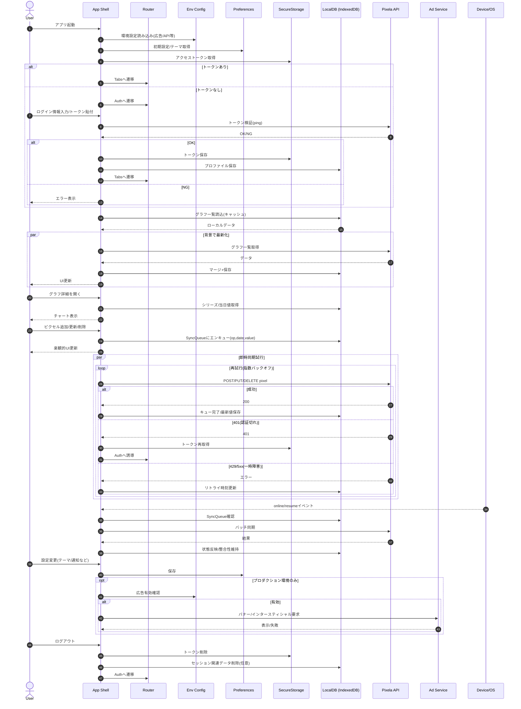

```mermaid
sequenceDiagram
  autonumber
  actor U as User
  participant App as App Shell
  participant Router
  participant Env as Env Config
  participant Prefs as Preferences
  participant Sec as SecureStorage
  participant DB as LocalDB (IndexedDB)
  participant Net as Pixela API
  participant Ads as Ad Service
  participant OS as Device/OS
  U ->> App: アプリ起動
  App ->> Env: 環境設定読み込み(広告/API等)
  App ->> Prefs: 初期設定/テーマ取得
  App ->> Sec: アクセストークン取得
  alt トークンあり
    App ->> Router: Tabsへ遷移
  else トークンなし
    App ->> Router: Authへ遷移
    U ->> App: ログイン情報入力/トークン貼付
    App ->> Net: トークン検証(ping)
    Net -->> App: OK/NG
    alt OK
      App ->> Sec: トークン保存
      App ->> DB: プロファイル保存
      App ->> Router: Tabsへ遷移
    else NG
      App -->> U: エラー表示
    end
  end

  App ->> DB: グラフ一覧読込(キャッシュ)
  DB -->> App: ローカルデータ
  par 背景で最新化
    App ->> Net: グラフ一覧取得
    Net -->> App: データ
    App ->> DB: マージ+保存
    App -->> U: UI更新
  end

  U ->> App: グラフ詳細を開く
  App ->> DB: シリーズ/当日値取得
  App -->> U: チャート表示
  U ->> App: ピクセル追加/更新/削除
  App ->> DB: SyncQueueにエンキュー(op,date,value)
  App -->> U: 楽観的UI更新
  par 即時同期試行
    loop 再試行(指数バックオフ)
      App ->> Net: POST/PUT/DELETE pixel

      alt 成功
        Net -->> App: 200
        App ->> DB: キュー完了/最新値保存
      else 401(認証切れ)
        Net -->> App: 401
        App ->> Sec: トークン再取得
        App ->> Router: Authへ誘導
      else 429/5xx(一時障害)
        Net -->> App: エラー
        App ->> DB: リトライ時刻更新
      end
    end
  end

  OS -->> App: online/resumeイベント
  App ->> DB: SyncQueue確認
  App ->> Net: バッチ同期
  Net -->> App: 結果
  App ->> DB: 状態反映/整合性維持
  U ->> App: 設定変更(テーマ/通知など)
  App ->> Prefs: 保存

  opt プロダクション環境のみ
    App ->> Env: 広告有効確認
    alt 有効
      App ->> Ads: バナー/インタースティシャル要求
      Ads -->> App: 表示/失敗
    end
  end

  U ->> App: ログアウト
  App ->> Sec: トークン削除
  App ->> DB: セッション関連データ削除(任意)
  App ->> Router: Authへ遷移
```
